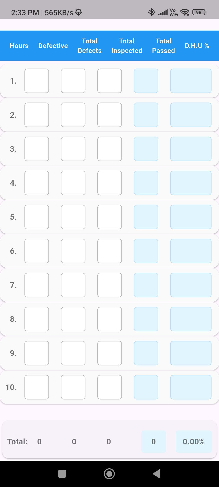
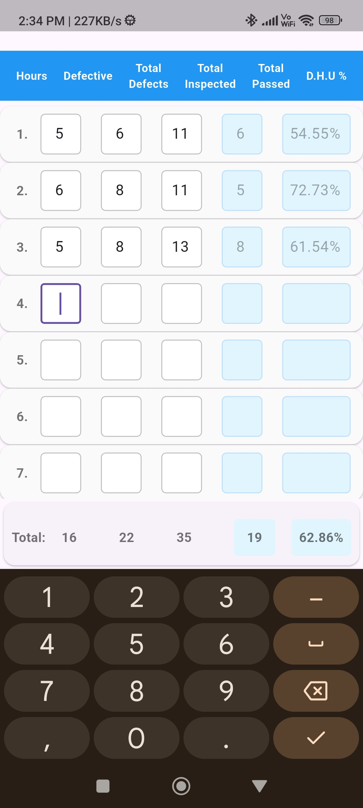
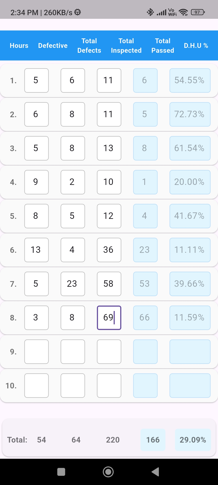

# 📋 QualityChecker  

🔍 **A Simple, Efficient Quality Control App – Built in Flutter**  

This app was built for a **nonprofit client in quality control** who needed a simple tool to streamline inspections and record-keeping. It features **a clean UI, an SQLite database for local storage, and an efficient workflow** designed for speed and ease of use.  

<div align="center">  
      
      
      
</div>  

## 🚀 Features  
* **Automated quality checks** – Reduces manual work with built-in validation  
* **SQLite database** – Efficient local storage for inspection records  
* **Minimalist, distraction-free UI** – Designed for ease of use  
* **Lightweight & fast** – Runs smoothly even on low-end devices  

---  

## 📥 Download & Install  

🔹 **Download the APK**  
Get the latest version from the **GitHub Releases page**:  

📎 **[Download QualityChecker v1.0.0](https://github.com/YourUsername/YourRepo/releases/latest/download/Quality%20Checker.apk)**  

🔹 **How to Install (Android)**  
Since this app is not from the Play Store, follow these steps to install it:  

1. **Download the APK** from the link above.  
2. Open the APK file in your file manager.  
3. If prompted, enable **"Install from Unknown Sources"**:  
   - Go to **Settings > Security**.  
   - Find **"Install unknown apps"** or **"Allow unknown sources"**.  
   - Select your file manager and enable the option.  
4. Tap **Install** and wait for the process to complete.  
5. Open the app and start using it! 🚀  

---  

## 🛠️ Build & Run  
To compile and run this Flutter project, make sure you have:  

✅ **Java 17** – Required for this project’s Android build  
✅ **Flutter dependencies installed** – Run `flutter doctor` to check setup  

### **Run the Project:**  
```sh
flutter pub get  
flutter run  
